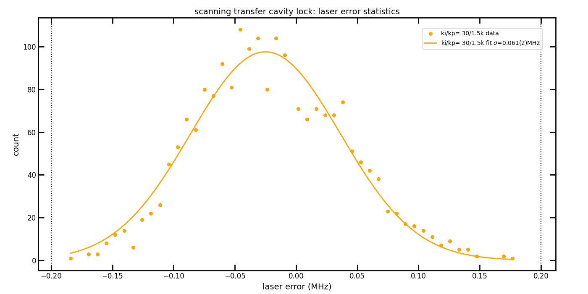
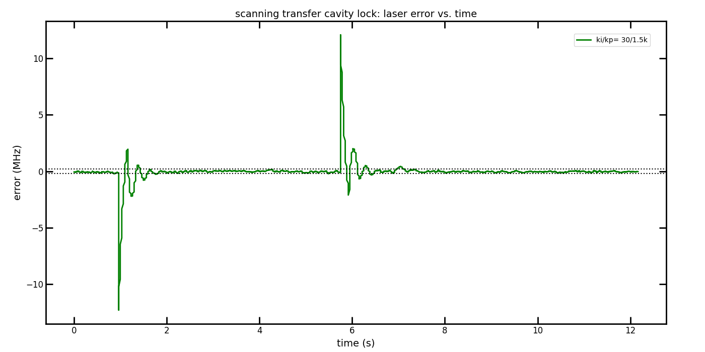
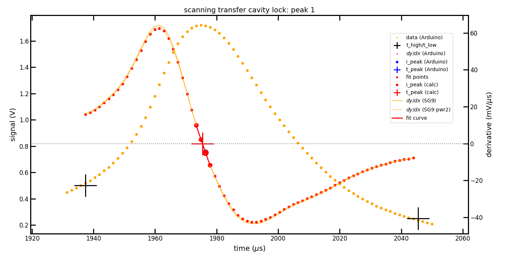

# scanning cavity lock

This is our implementation of the scanning cavity transfer lock with Arduino Due.

This work is based on the [publication](https://doi.org/10.1063/1.5067266) `Microcontroller based scanning transfer cavity lock for long-term laser frequency stabilization` by S. Subhankar, A. Restelli, Y. Wang, S. L. Rolston, and J. V. Porto, Rev. Sci. Instrum. 90, 043115 (2019). We have heavily modified the [original source on github](https://github.com/JQIamo/Scanning-Transfer-Cavity-Lock).

With respect to the previous work, we have added following features:
  * Direct generation of the cavity triangle ramp and offset on the Arduino Due
  * Average of measured peak positions before feedback
  * 9-point Savitzky-Golay filter for derivative
  * Linear fit of the zero crossing taking up to 8 data points
  * 6 peak positions allow 2x feedback on the laser per ramp period
  * Typical cavity ramp rate of 170Hz (6ms) gives 340Hz (3ms) feedback time 
  * Measured calculation time 50-100μs per peak (depending on activated features)
  * Measured <100kHz residual laser noise (1σ standard deviation derived from error signal)
  * Commands via `Serial Monitor` for feedback optimization, change of setpoint and measurement of noise and step function responds
  * Fast download of measured peaks and derivatives via `Arduino Due native USB port`
  * Python tools for ramp buffer generation, download of peak data and statistical analysis
  * Thorough code review and optimization
  * Work in progress: median filter for better noise resilience

Here an overview of the folder structure:

```
└── scanning-cavity-lock    main folder
    ├── SCTL_Arduino        Arduino Due project folder
    ├── images              images for readme
    └── tools               python folder
        └── sample_data     example data
```

## Overview

We use Ytterbium (Yb-174 or Yb-171) atoms in a tweezer experiment. We have a 556nm (green) laser (from NKT/Toptica/Azurlight) which is locked on an ultra-stable cavity (for details see here](https://github.com/INO-quantum/RedPitaya_ULE_cavity_lock)). This is used for the green magneto-optic trap (MOT) with a linewidth of 180kHz. This green laser is our reference for the scanning transfer cavity (Thorlabs SA200-5B, 535-820nm, 1.5GHz FSR) used to lock the 399nm (violet-blue) laser (from Toptica). Since the 399nm transition is ~30MHz wide it is we need to correct only for slow laser drifts but do not need to narrow the linewidth. For this purpose the scanning cavity lock is ideal since it just requires a relative cheap cavity and photo-detector and can lock at an arbitrary software-controlled offset without the need of additonal AOM or EOM and locking electronics for modulation/demodulation. We use an Arudino Due which has true analog input and outputs, but is limited with the resolution to 12bits. In order to drive the piezo of the cavity we need an additional amplifier which gives us about 0-10V (at the moment the `LENS-PID` is used for this). This is sufficient but maybe in the future it would be useful to have a range of 0-20V to have a wider tuning range for long-term drifts.

## Initial setup

The actual setup with green and blue laser, the ULE cavity on the left and in front of it the scanning Fabry-Perot cavity with the photodetector:


The Arduino Due in front of the `LENS-PID` used to amplify the ramp signal for the cavity piezo:


Oscilloscope trace: channel 1 (yellow): PD signal, channel 2 (red): cavity piezo ramp (PID monitor output), channel 3 (blue): laser feedback signal (attenuated by factor 10), channel 4 (green): ramp trigger generated by Arduino


Hardware used:
  * Arduino Due
  * Scanning Fabry-Perot Interferometer (Toptica SA200-5B)
  * Photodetector (Thorlabs PDA100A2)
  * Amplifier with adjustable gain (5x used) and 0-10V output (we use the `LENS-PID` )

Software used:
  * Arduino IDE 2.3.8
  * Optional python 3.8 with Numpy 1.24.4, Scipy 1.10.1 and Matplotlib 3.7.5 for tools
  
Arduino connections:
  * A0   = input of photodetector signal
  * DAC0 = output of laser feedback
  * DAC1 = output of ramp + offset
  * D7   = output of trigger signal for scope
  * D8   = output of digital signal for debugging

Setup steps:
  * Connect the Arduino with USB (programming port is close to power plug; optionally power with 5V on power plug to be independent of computer)
  * Open Arduino IDE and open the sketch `SCTL_Arduino/SCTL_Arduino.ino`
  * Ensure `USE_SERIAL` is set to `SERIAL_PROG` such that you can later connect with `Serial Monitor`
  * Select Arduino Due as board (you might need to install it in `Boards Manager`) and upload the sketch
  * In `Serial Monitor` (using baud rate 115200) set all gains to zero with the commands: `Lki0`, `Lkp0`, `Rki0`, `Rkp0`. Send the commands individually by pressing `Enter` after each command. This allows to scan the cavity without the feedback while you are aligning it. Optionally, you can also set `laser_ki`, `laser_kp`, `ramp_ki` and `ramp_kp` to zero in the script before uploading. Ignore errors 10-15 which the Arduino will display, since it cannot find the cavity peaks.
  * Connect the amplifier to DAC1 output and adjust the offset and gain of the amplifier to get minimum 0V and 10-20V output. We use the `LENS-PID` with gain=5 which gives about 4.5Vpp on the piezo and about 0-10V scanning range. This PID is convenient since it has not only gain and offset settings but also an input offset to cancel the 0.55V offset of the DAC1 output of the Arduino. For the initial alignment it might be useful to scan by more than 4.5Vpp, i.e. to scan more than one FSR of the cavity. We have added low-pass filters on the input and output of the `LENS-PID` to avoid oscillations and to reduce noise. This causes a visible phase-shift (`RAMP_DELAY_MU` ~150μs) of the ramp and PD signal vs. the ramp trigger signal (on D7).
  * Couple the reference (green) and controlled (blue-violet) lasers into the Fabry-Perot interferometer (FPI). The resolution is ~7.5MHz and is limited by the cavity finess of about 200. Additionally, since the cavity is confocal, higher transverse modes are not resolved but lead to asymmetric lineshape. A non-confocal FPI with higher finesse would give separate narrower lines for each mode.
  * Adjust the photodetector gain to get maximum 3.3V output at maximum power and connect the signal to the analog input A0.
  * Set the low and hight thresholds `LOW_THRESHOLD_V` and `HIGH_THRESHOLD_V` in volt to match your peaks. The high threshold can be set to about 50% of your actual peak voltage to ensure that even with power fluctuations the peak is still found reliably. The low threshold should be set clearly (~factor 1/2) below the high threshold.
  * Adjust the output offset of the amplifier such that the reference peak is close to `RAMP_SET_MU` in μs (550μs). Note that this value cannot be smaller than `RAMP_DELAY_MU` (see above) and `RAMP_DELAY_MIN` given by the time it takes to fill one buffer (~200μs). 
  * At this point errors 10 + peak number = not found peaks 0 .. `NUM_PEAKS`-1 should be cleared. When no error is present the orange LED on the Arduino should be switching off and `error cleared` should be printed in the `Serial Monitor`.
  * With the command `p6` you can monitor the actual measured laser positions in units of `TICKS` = 1μs/86, followed by the laser error signal and laser output (in amplitude units 0..4095) and the ramp error signal and ramp output. The command `p6r` contiguously outputs the actual values until `Enter` is pressed. This allows to collect statistics of the error signal.
  * In `Serial Monitor` set a small ramp integral part `Rki1` and press `Enter` and you should see the Arduino adjusting the ramp offset when you change the output offset of the amplifier. The first peak should be staying at `RAMP_SET_MU`.
  * Adjust `LASER_SET_MU` to the expected delay time in μs between `RAMP_SET_MU` and the controlled laser scan position and adjust `LASER_REF_MU` to the FSR of the reference laser in μs. A coarse adjustment of the integral part is sufficient at the beginning.
  * Connect the laser feedback input to DAC0 output and enable feedback on the laser (we use `Fine 1` on the Toptica laser with 0.3V/V gain)
  * Now you can adjust the laser integral and proportional-gains to get the initial locking using `Lki#` and `Lkp#` commands on the `Serial Monitor` where the `#` indicates the gain value. 
  * In `Serial Monitor` use the `p6r` command to trace the laser error for some time (we use  10s) and press `Enter` to stop the trace. Select the `Serial Monitor` output and save it into a text file which you can use in the python script `tools/statistics.py` to analyze and display statistics of the laser error (see note for IDE 2 below). Using the ki and kp values to minimize the laser error (`sigma` in the statistics output and plot). You can insert a `#` symbol after the arrow `->` in the text file in order to skip unwanted output from the analysis. This is useful to keep in the file the actual commands used for the trace. 
  * For fine-adjustment of the feedback parameters you can use the step function command `Ls#r` which works as `p6r` but offsets the laser setpoint by `#` μs after 1s and sets it back after another 5s. As before, use `statistics.py` to analyze the trace and optimize for fastest damping. This optimization usually requires to reduce the gains from the previous step since high gains tend to oscillate longer and one has to find a good compromize between fast damping and small error. Here the error vs. time plot is useful as well as the FFT plot.
  * At the moment no derivative part is implemented, but it might be helpful to get faster damping times. However, from experience it might be tricky to adjust that it does not add too much high-frequency noise.
  * The same optimization can be done on the ramp feedback using the commands `Rki#` and `Rkp#` to adjust the ramp integral and proportional feedback parameters. The commands `p6r` can be used as before for obtaining statistics of the ramp error signal and the step function command `Rs#r` can be used to generate a trace for the step respond.
  * After this optimization the lock is ready to be used. Using this lock we get a stable green MOT by adjusting the setpoint `LASER_SET_MU` with the `Ls#` command.

> [!NOTE]
> For Arduino IDE 2 on the `Serial Monitor` one cannot select longer output and copy to clipboard, but there is an icon to copy the entire output to clipboard. However, this does not include the date and time! - but which is needed for the analysis with the python tools. To fix this, the next version of the script `p6r` will print out also the actual SysTicks time of the board which should allow to get more precise time information than before, but the python scripts have to be adjusted for this.


## Performance

The measured laser noise for 10s duration gives standard deviation 61(2)kHz (laser_kp = 1500, laser\_ki = 30):



The 20μs step responds with the same laser feedback settings as before:

Within about 1s the laser error (orange) is back within ±200kHz (gray dashed).


  
One example lineshape and derivative obtained with the `tools/read_data.py` script (for details see readme in tools folder):

Peak data = orange points (Arduino), derivative data = red points (Arduino), high and low thresholds = black crosses, fit points of zero crossing = red lines and points (4 in this case), zero crossing of derivative = red cross (python) and blue cross (Arduino, below red cross), orange solid lines = 9-point Savitzky-Golay filter, orange dashed lines = 9-point Savitzky-Golay filter using power of 2 factors (implemented on Arduino for better efficiency). 


  
> [!NOTE]
> The presented error here is obtained only from the error signal and is **not** an independent measure of the achieved locking performance. A more precise way would be to measure the Alan deviation using a wavemeter locked to a laser referenced to an atomic transition.


## Discussion

The actual performance is sufficient for the relative wide blue-violet 399nm transition of Ytterbium atoms. At present (March 2026) we have limited data about the stability and drifts. We need to change the setpoint from day to day by about 10μs and the lock is stable throughout one working day, but we have not monitored correlations with temperature, air pressure and humidity. 

The achievable stability is clearly limited by two factors: 1. the 12bit resolution of the digital input and output of the Arduino Due limits the achievable residual noise and we see clear digitalization jumps on the ramp offset. 2. The responds time of the feedback is limited by the scan period. One might increase the scanning frequency but we have not found a maximum frequency specification of the cavity which should be limited by the first resonance frequency of the piezo, and is typically in the few 100Hz to few kHz range. 

The calculation time of the peak position at the moment is not a limit, which allows us to implement more complicated but also more robust schemes which includes averaging, 9-point Savitzky-Golay filter, fitting of several peaks and median filter. One constraint however is, that the peaks need to be separated more than the calculation time from each other.

For locking a laser intended for a narrower transition, drifts and the slow freedback time would become more important. Drifts are expected to be more significant when the wavelengths of the reference laser and of the controlled laser are farther apart. The present scheme is certainly not fast enough to reduce the linewidth of a laser and the limited resolution does not allow to get very low residual noise.

The present setup would allow to lock even several lasers but the Arduino Due has only 2 analog outputs, where one is used for ramp generation and the other for feedback of one laser. If one would generate the ramp externally and provide an external ramp trigger input into the Arduino (as is done in the original publication), then one could feedback on a second laser, as long as the lines on the cavity are sufficiently separated from each other.


