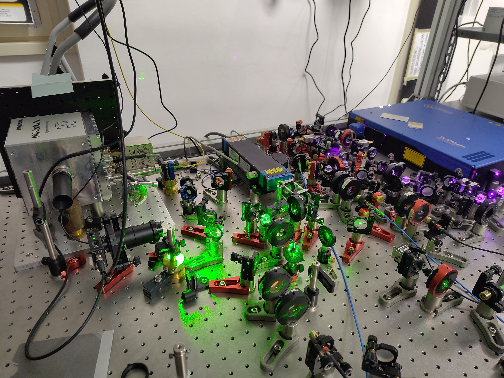
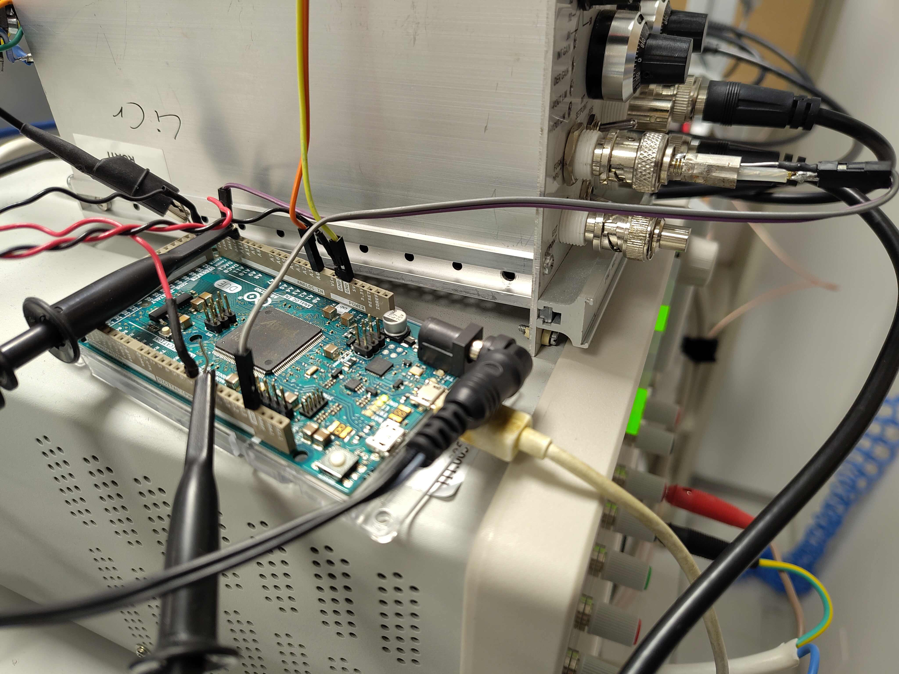
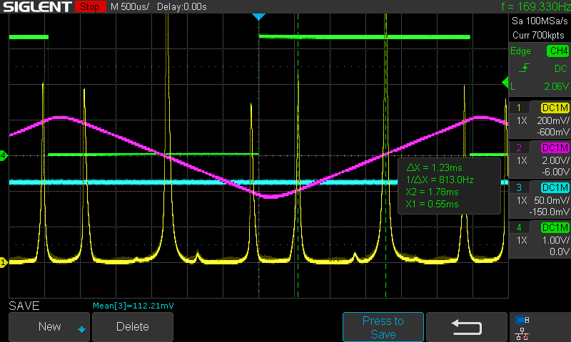

# scanning cavity lock

This is our implementation of the scanning cavity transfer lock with Arduino Due.

This work is based (loosely) on the [publication](https://doi.org/10.1063/1.5067266) `Microcontroller based scanning transfer cavity lock for long-term laser frequency stabilization` by S. Subhankar, A. Restelli, Y. Wang, S. L. Rolston, and J. V. Porto, Rev. Sci. Instrum. 90, 043115 (2019), [and on the github page](https://github.com/JQIamo/Scanning-Transfer-Cavity-Lock).

With respect to the previous publication we have added following features:
  * generation of the cavity triangular ramp and offset on the Arduino Due
  * average of measured peak positions before feedback
  * 9-point or 5-point Savitzky-Golay filter for derivative
  * linear fit of zero crossing with 2,4,6 or 8 points for better resilience against noise
  * 6 peak positions allow 2x feedback on laser per triangular ramp period
  * typical cavity ramp rate 170Hz (6ms) gives 340Hz (3ms) feedback time 
  * measured calculation time ca. 50μs per peak
  * measured 50kHz residual laser noise (1σ standard deviation, obtained from error signal, limited by analog resolution)
  * commands via `Serial Monitor` for feedback optimization, change of setpoint and measurement of noise and step function responds
  * fast download of measured peaks and derivatives via `Arduino Due native USB port`
  * python tools for ramp buffer generation, download of peak data and statistical analysis
  * thorough code review and optimization
  * work in progress: median filter for better noise resilience

Here an overview of the folder structure:

```
└── scanning-cavity-lock    main folder
    ├── SCTL_Arduino        Arduino Due project folder
    ├── images              images for readme
    └── tools               python folder
```

## Overview

We use Ytterbium (171) atoms in a tweezer experiment. We have a 556nm (green) laser (from Toptica/Azurlight) which is locked on an ultra-stable cavity. This is used for the green magneto-optic trap (MOT) with a linewidth of 180kHz. This green laser is our reference for the scanning transfer cavity (Thorlabs SA200-5B, 535-820nm, 1.5GHz FSR) used to lock the 399nm (violet-blue) laser (Toptica). The 399nm transition is ~30MHz wide which is not very stringent and it is sufficient to correct for slow drifts of the laser. Therefore, the scanning cavity lock is an ideal solution using a cheap cavity, lock at an arbitrary software-controlled offset without requirement of additonal AOM or EOM and locking electronics. We use an Arudino Due which has true analog input and outputs - but is a bit limited with the resolution to 12bits. In order to drive the piezo of the cavity we need an additional amplifier which gives us about 0-10V. This is sufficient but maybe in the future it would be useful to have a range of 0-20V.

## Initial setup

The actual setup with green and blue laser, the ULE cavity on the left and in front of it the scanning Fabry-Perot cavity with the photodetector:


The Arduino Due in front of the `LENS-PID` used to amplify the ramp for the cavity:


Oscilloscope trace: channel 1 (yellow): PD signal, channel 2 (red): ramp, channel 3 (blue): laser feedback signal, channel 4 (green): ramp trigger


Hardware needed:
  * Arduino Due
  * Scanning Fabry-Perot Interferometer (Toptica SA200-5B or similar)
  * Photodetector (Thorlabs PDA100A2 or similar)
  * Amplifier with about 5-10 gain and 0-20V output (we use `LENS-PID` at the moment)

Software needed:
  * Arduino IDE
  * Optional python 3.x for tools
  
Arduino connections:
  * A0   = input of photodetector signal
  * DAC0 = output of laser feedback
  * DAC1 = output of ramp + offset
  * D7   = output of trigger signal for scope
  * D8   = output of digital signal for debugging

Setup steps:
  * Power up the Arduino (USB or external 5V)
  * Open Arduino IDE and open the sketch `SCTL_Arduino/SCTL_Arduino.ino`
  * Ensure the `USE_SERIAL` is set to `SERIAL_PROG` such that you can connect with `Serial Monitor`
  * Upload the sketch
  * Open `Serial Monitor`
  * Set all gains to zero with the commands: `Lki0`, `Lkp0`, `Rki0`, `Rkp0` - all sent individually by pressing `Enter`. This allows to scan the cavity without the feedback while you are aligning it. Optionally, you can also set `laser_ki`, `laser_kp`, `ramp_ki` and `ramp_kp` to zero in the script before uploading. You can ignore error 10 which the Arduino will display, since it cannot find the first peak.
  * Connect the amplifier to DAC1 output and adjust the offset and gain to get minimum 0V and >10V output. We use the `LENS-PID` with fixed gain=5 which gives about 4.5Vpp on the piezo for the scanning and about 0-10V scanning range. This PID is convenient since it has input and output offset and adjustable gain. The input offset is adjusted to cancel the 0.55V offset of the DAC output of the Arduino and the output offset is to adjust the working point of ramp. For the initial alignment it might be useful to increase `RAMP_FRAC` to scan by more than 4.5Vpp or the equivalent voltage needed to scan one FSR of the reference laser. We have added low-pass filters on the input and output of the `LENS-PID` to avoid oscillations and to reduce noise. This causes a visible phase-shift of the ramp signal vs. the actual PD signal of `RAMP_DELAY_MU` (~150μs). It might be more convenient to use a signal generator for the ramp.
  * Couple the reference and controlled lasers into the Fabry-Perot cavity. Note that when the cavity is a confocal FPI as the one used here, higher transverse modes are not resolved but lead to asymmetric shape of the line. A non-confocal FPI would give separate narrower lines for each mode.
  * Adjust the photodetector gain to get maximum 3.3V output at maximum power and connect the signal to the analog input A0.
  * Set the low and hight thresholds `LOW_THRESHOLD_V` and `HIGH_THRESHOLD_V` in volt to match your peaks. High threshold can be set to about 50% of your actual peak high to ensure that even with power fluctuations the peak is still found reliably. The low threshold should be set clearly below the high threshold (factor 1/2 is ok if the background noise allows).
  * Adjust the output offset of the amplifier such that the reference peak is close to `RAMP_SET_MU` in μs (550μs). Note that this value cannot be smaller than `RAMP_DELAY_MU` (see above) and `RAMP_DELAY_MIN` given by the time it takes to fill one buffer (~200μs). 
  * At this point errors 10 + peak number = not found peaks 0 .. `NUM_PEAKS`-1 should be cleared. When no error is present the LED on the Arduino should be switching off and `error cleared` should be printed in the `Serial Monitor` (at the moment this does not work). In case you want to consider only 3 peaks (ramping up) instead of the standard 6 peaks (ramping up and down) you can set `NUM_PEAKS` from 6 to 3. 
  * With the command `p6` (or `p3` for `NUM_PEAKS`=3) you can monitor the actual measured laser positions in units of `TICKS` = 1μs/86, followed by the laser error signal and laser output (in amplitude units 0..4095) and the ramp error signal and ramp output. The command `p6r` (or `p3r`) contiguously outputs the actual values until `Enter` is pressed.
  * In `Serial Monitor` set a small ramp integral part `Rki10` and press `Enter` and you should see the Arduino adjusting the ramp offset when you change the output offset of the amplifier. The first peak should be staying at `RAMP_SET_MU`.
  * Adjust `LASER_SET_MU` to the expected delay time in μs between `RAMP_SET_MU` and the controlled laser scan position and adjust `LASER_REF_MU` to the FSR of the reference laser in μs. A coarse adjustment of the integral part is sufficient at the beginning.
  * Connect the laser feedback input to DAC0 output and enable feedback on the laser (we use `Fine 1` on the Toptica laser with 0.3V/V gain)
  * Now you can adjust the laser integral and proportional-gains to get the initial locking using `Lki#` and `Lkp#` commands on the `Serial Monitor` where the `#` indicates the gain value. 
  * In `Serial Monitor` use the `p6r` (or `p3r`) command to trace the laser error. You can select the output and save it into a text file and use the python script `tools/p3_statistics.py` to analyze and display statistics of the laser error. Using the ki and kp values minimize the laser error (`sigma` in the statistics). Insert a `#` symbol after the arrow `->` in the text file in order to skip unwanted output. This is useful to keep in the file the actual commands used for the trace. 
  * For fine-adjustment of the feedback parameters you can use the step function command `Ls#r` which works as `p6r` but offsets the laser setpoint by +`#` μs after 1s and sets it back after another 5s. Use `p3_statistics.py` to analyze the trace for a fastest damping. This optimization usually requires to reduce the gains from the previous step since high gains tend to oscillate longer and one has to find a good compromize. Here the error vs. time plot is useful as well as the FFT plot.

